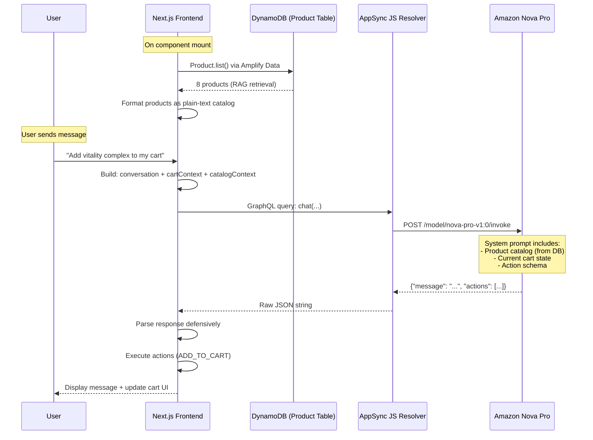

# 🌿 NatureMama Heritage : AI Shopping Assistant

> A production-grade AI-powered e-commerce chatbot built with **Amazon Nova Pro**, **AWS Amplify Gen 2**, and **AppSync JS Resolvers** : demonstrating RAG-style context injection, structured tool-use, and serverless AI agent architecture.

<p align="center">
  <a href="docs/demo.mp4">
    
  </a>
</p>

> **📹 Demo:** Click the badge above to download and watch the 82-second demo showing RAG retrieval, AI-powered cart management, and real-time action execution.


---

## 🎯 What This Project Demonstrates

| Skill | Implementation |
|-------|---------------|
| **AI Agent Architecture** | LLM returns structured JSON actions that the frontend executes (add to cart, navigate, clear cart) |
| **RAG / Context Injection** | Live product catalog retrieved from DynamoDB and injected into the LLM system prompt at query time |
| **Prompt Engineering** | Structured output enforcement (JSON-only responses), temperature tuning, multi-turn conversation |
| **Serverless AI Backend** | Direct AppSync → Bedrock integration via JS resolvers : zero Lambda cold starts |
| **Full-Stack Integration** | React frontend wired to AI backend with real-time cart management and navigation |
| **Observability** | Model invocation logging enabled via CloudWatch for debugging and cost monitoring |

---

## 🏗️ System Architecture

```
┌─────────────────────────────────────────────────────────────────────┐
│                         FRONTEND (Next.js 14)                        │
│                                                                     │
│  ┌──────────────┐    ┌──────────────────┐    ┌──────────────────┐  │
│  │  Chat UI     │    │  CartContext     │    │  Product List    │  │
│  │  (floating   │◄──►│  (useReducer +   │    │  (Amplify Data   │  │
│  │   bubble)    │    │   localStorage)  │    │   client.list()) │  │
│  └──────┬───────┘    └──────────────────┘    └────────┬─────────┘  │
│         │                                              │            │
│         │  ┌───────────────────────────────────────────┘            │
│         │  │  RAG RETRIEVAL: Products fetched from DynamoDB         │
│         │  │  and formatted as plain-text catalog context           │
│         ▼  ▼                                                        │
│  ┌─────────────────────────────────────────────────────────────┐   │
│  │  GraphQL Mutation: chat(conversation, cartContext,           │   │
│  │                         catalogContext)                      │   │
│  └─────────────────────────────┬───────────────────────────────┘   │
└────────────────────────────────┼────────────────────────────────────┘
                                 │
                                 ▼
┌─────────────────────────────────────────────────────────────────────┐
│                    AWS AppSync (GraphQL API)                          │
│                                                                     │
│  ┌─────────────────────────────────────────────────────────────┐   │
│  │              AppSync JS Resolver (chatHandler.js)             │   │
│  │                                                             │   │
│  │  1. Receives: conversation + cartContext + catalogContext    │   │
│  │  2. Builds system prompt with RAG context                   │   │
│  │  3. Formats Nova Pro request (messages-v1 schema)           │   │
│  │  4. Returns structured JSON response                        │   │
│  └─────────────────────────────┬───────────────────────────────┘   │
│                                │                                    │
│                    HTTP Data Source (IAM-signed)                     │
└────────────────────────────────┼────────────────────────────────────┘
                                 │
                                 ▼
┌─────────────────────────────────────────────────────────────────────┐
│              Amazon Bedrock (us-east-1)                               │
│                                                                     │
│  ┌─────────────────────────────────────────────────────────────┐   │
│  │  Amazon Nova Pro (amazon.nova-pro-v1:0)                      │   │
│  │                                                             │   │
│  │  • Temperature: 0.3 (deterministic JSON output)             │   │
│  │  • Max tokens: 1024                                         │   │
│  │  • System prompt: catalog + cart + action schema            │   │
│  │  • Output: {"message": "...", "actions": [...]}             │   │
│  └─────────────────────────────────────────────────────────────┘   │
└─────────────────────────────────────────────────────────────────────┘
                                 │
                                 ▼
┌─────────────────────────────────────────────────────────────────────┐
│                    RESPONSE FLOW                                      │
│                                                                     │
│  Nova Pro Response                                                  │
│       │                                                             │
│       ▼                                                             │
│  AppSync returns raw text ──► Frontend parses JSON defensively      │
│                                      │                              │
│                          ┌───────────┼───────────┐                  │
│                          ▼           ▼           ▼                  │
│                    Display      Execute       Navigate               │
│                    message      cart actions   to page               │
│                                                                     │
│  Example response from Nova Pro:                                    │
│  {                                                                  │
│    "message": "I've added Vitality Complex to your cart!",          │
│    "actions": [{                                                    │
│      "type": "ADD_TO_CART",                                         │
│      "productId": "abc-123",                                        │
│      "productName": "Vitality Complex",                             │
│      "price": 42,                                                   │
│      "slug": "vitality-complex",                                    │
│      "quantity": 1                                                  │
│    }]                                                               │
│  }                                                                  │
└─────────────────────────────────────────────────────────────────────┘
```

### Data Flow (Mermaid)



---

## 🧠 Design Decisions

### 1. Context Stuffing vs. Vector Database RAG

| Approach | Our Choice | Why |
|----------|-----------|-----|
| **Vector DB (Pinecone, OpenSearch, etc.)** | ❌ Not used | Massive overkill for 8-50 products. Adds infrastructure cost, embedding pipeline complexity, and latency. |
| **Context Stuffing (DynamoDB Scan → Prompt)** | ✅ Used | With a small catalog (<100 products), the entire inventory fits within Nova Pro's context window. Zero additional infrastructure. Sub-second retrieval. |

**The engineering principle:** Choose the simplest architecture that solves the problem. A vector database becomes necessary at ~500+ products or when semantic similarity search adds value (e.g., "something for relaxation" matching products tagged differently). For our catalog size, a full DynamoDB scan + prompt injection is:
- **Faster** (single DynamoDB scan vs. embedding + vector search)
- **Cheaper** ($0 additional infrastructure)
- **More maintainable** (no embedding pipeline to manage)
- **Equally effective** (Nova Pro can reason over 8 products trivially)

**When to upgrade:** If the catalog grows beyond ~200 products, switch to Amazon Bedrock Knowledge Bases with OpenSearch Serverless for true semantic retrieval.

---

### 2. AppSync JS Resolver vs. Lambda Function

| Approach | Latency | Cold Start | Cost |
|----------|---------|-----------|------|
| **Lambda** | ~200-800ms overhead | Yes (up to 3s on cold start) | Per-invocation + duration |
| **AppSync JS Resolver** | ~5-10ms overhead | None | Included in AppSync request cost |

We chose **AppSync JS Resolvers** because:
- **Zero cold starts** : the resolver executes within AppSync's runtime, not a separate compute environment
- **Direct HTTP to Bedrock** : no intermediate Lambda hop; AppSync signs the request with IAM and calls Bedrock directly
- **Lower latency** : eliminates ~200ms of Lambda overhead per request
- **Simpler deployment** : no separate function packaging, dependency management, or runtime configuration
- **Cost efficient** : no Lambda invocation charges; the AppSync request cost covers everything

**Trade-off acknowledged:** AppSync JS has a restrictive runtime (no npm packages, limited APIs). For our use case (format a prompt → call an HTTP endpoint → parse response), it's more than sufficient.

---

### 3. Structured JSON Output (Tool-Use Pattern)

Instead of parsing free-text responses for action keywords, we enforce **structured JSON output** from the LLM:

```json
{
  "message": "I've added 2 Vitality Complex to your cart! Anything else?",
  "actions": [
    {
      "type": "ADD_TO_CART",
      "productId": "abc-123-def",
      "productName": "Vitality Complex",
      "price": 42,
      "slug": "vitality-complex",
      "quantity": 2
    }
  ]
}
```

**Why this approach:**
- **Reliability**: JSON parsing is deterministic; regex extraction of actions from free text is fragile
- **Temperature 0.3**: low temperature keeps the model disciplined about output format
- **Separation of concerns**: the LLM decides *what* to do; the frontend decides *how* to do it
- **Extensible** : adding new action types (e.g., `APPLY_COUPON`, `SHOW_COMPARISON`) requires only schema documentation in the prompt, no code changes to the resolver

**Supported actions:**

| Action | Fields | Effect |
|--------|--------|--------|
| `ADD_TO_CART` | productId, productName, price, slug, quantity | Adds item(s) to cart via CartContext |
| `REMOVE_FROM_CART` | productId | Removes item from cart |
| `CLEAR_CART` | : | Empties the entire cart |
| `NAVIGATE` | path (`/cart` or `/products`) | Routes user to a page |

---

### 4. Defensive Response Parsing

LLM outputs are unpredictable. Our frontend parser handles:
- ✅ Clean JSON: `{"message": "...", "actions": [...]}`
- ✅ Double-stringified: `"{\"message\": \"...\"}"`
- ✅ Markdown-wrapped: `` ```json {...} ``` ``
- ✅ Extra whitespace / newlines
- ✅ Partial JSON (extracts between first `{` and last `}`)
- ✅ Complete failures (falls back to displaying raw text)

---

## 📊 Observability & Monitoring

**Model Invocation Logging** is enabled via Amazon CloudWatch. Every Bedrock call is logged with:
- Input/output token counts
- Latency metrics
- Full request/response payloads (for debugging prompt issues)
- Cost tracking per invocation

Access logs at: **CloudWatch → Log Groups → `/aws/bedrock/modelinvocations`**

---

## 🛠️ Tech Stack

| Layer | Technology | Purpose |
|-------|-----------|---------|
| Frontend | Next.js 14, React 18, Tailwind CSS | UI, routing, state management |
| AI/LLM | Amazon Nova Pro (Bedrock) | Natural language understanding + structured output |
| API | AWS AppSync (GraphQL) | Managed API with JS resolvers |
| Database | Amazon DynamoDB | Product catalog, user data, orders |
| Auth | Amazon Cognito | User authentication + groups |
| Storage | Amazon S3 | Product images, assets |
| IaC | AWS Amplify Gen 2 (CDK) | Infrastructure as TypeScript |
| Observability | CloudWatch | Model invocation logging |

---

## 🚀 Getting Started

### Prerequisites
- Node.js 18+
- AWS account with Bedrock access (us-east-1)
- AWS CLI configured (`aws configure`)

### Setup

```bash
# Clone the repository
git clone https://github.com/YOUR_USERNAME/naturemama-heritage.git
cd naturemama-heritage

# Install dependencies
npm install

# Deploy the backend (creates Cognito, AppSync, DynamoDB, S3, Bedrock data source)
npx ampx sandbox

# In a separate terminal, start the frontend
npm run dev
```

Visit `http://localhost:3000` : click the chat bubble in the bottom-right corner.

### Seed the Database

The project includes a seed component. Temporarily add `<SeedDatabase />` to the homepage, click the button to populate DynamoDB with sample products, then remove it.

---

## 📁 Project Structure

```
├── amplify/
│   ├── backend.ts              # Amplify backend + Bedrock HTTP data source
│   ├── auth/resource.ts        # Cognito config (email + admin group)
│   ├── data/
│   │   ├── resource.ts         # GraphQL schema (chat query + data models)
│   │   └── chatHandler.js      # AppSync JS resolver (Bedrock integration)
│   └── storage/resource.ts     # S3 bucket config
│
├── src/
│   ├── components/
│   │   ├── chat/
│   │   │   └── ShoppingAssistant.tsx   # ★ AI chatbot (RAG + action execution)
│   │   ├── admin/
│   │   │   └── SeedDatabase.tsx        # Database seeding tool
│   │   └── ...
│   ├── context/
│   │   └── CartContext.tsx             # Cart state (actions target this)
│   └── app/
│       ├── layout.tsx                  # Root layout with providers
│       └── page.tsx                    # Homepage
│
└── README.md                           # You are here
```

---

## 🔑 Key Files to Review

| File | What it demonstrates |
|------|---------------------|
| `amplify/data/chatHandler.js` | AppSync JS resolver : prompt construction, Bedrock HTTP call, response parsing |
| `amplify/backend.ts` | CDK infrastructure : HTTP data source with IAM signing for Bedrock |
| `src/components/chat/ShoppingAssistant.tsx` | Full AI agent frontend : RAG retrieval, conversation management, action execution, defensive parsing |
| `amplify/data/resource.ts` | GraphQL schema with custom query definition and authorization |

---

## 📈 Future Enhancements

- [ ] **Vector DB RAG** : Migrate to Bedrock Knowledge Bases when catalog exceeds 200 products
- [ ] **Conversation persistence** : Store chat history in DynamoDB for cross-session context
- [ ] **Streaming responses** : Use AppSync subscriptions for token-by-token streaming
- [ ] **Multi-modal** : Accept product images in chat for visual search
- [ ] **A/B testing** : Compare Nova Pro vs Claude for response quality metrics

---

## 📄 License

MIT

---

*Built as a portfolio demonstration of AI agent architecture, RAG patterns, and serverless LLM integration on AWS.*
